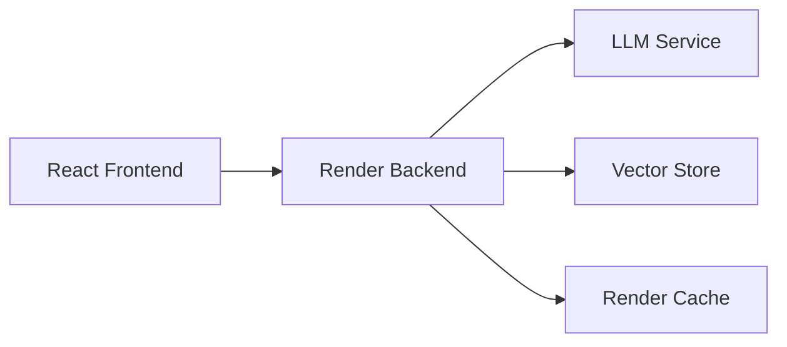

# Interactive AI Portfolio 🤖

I’ve developed an AI-powered conversational portfolio that invites visitors to engage directly with an intelligent assistant fully versed in my work, experience, and areas of expertise. Through its interactive chat interface, users can ask questions about my past projects, seek insights into my professional journey, or explore the skills I’ve honed over the years—and receive thoughtful, context-aware responses in real time. This dynamic showcase not only highlights my accomplishments but also fosters meaningful dialogue, allowing each visitor to discover exactly how my background and capabilities align with their interests.

## ✨ Key Features

- 🤖 **Interactive AI Assistant**: Engage visitors with personalized, context-aware conversations
- 🚀 **Real-time Streaming**: Fluid, chat-like experience with streaming responses
- 🎨 **Modern UI**: Clean, responsive design focused on conversation

## 🏗 Architecture

### Tech Stack

- **Frontend**: React + Netlify, TailwindCSS
- **Backend**: Render

## 📝 License

This project is licensed under the MIT License - see the [LICENSE](LICENSE) file for details.
